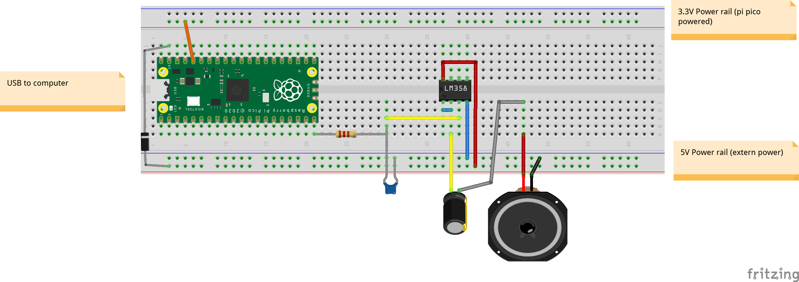
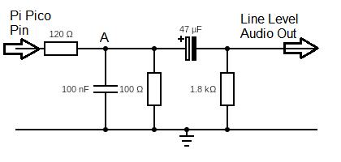

# pi-pico-Tone
Simple Tone library for Pi Pico SDK

Sometimes you want the pico to put out some tones. This simple tone library allows one to do this. The library allows you (in non-blocking mode) to play tones via dma, so the processor is free to do other things. It can also be played directly via the processor, blocking all other activities (on that core) while it is playing the tone. 

The tone is generated as a sine waves (default) with configurable harmonics. As such it is fundamentally different and a little more "advanced" than the classical PWM tone generators. 

When using dma (non_blocking) a maximum of 4 tone generators can run at the same time on 4 different pins of choice. When the blocking mode is used one can define as many tone generators as the PIO statemachines will allow (8 max, if no other usage), but in that case they will not be able to play at the same time. 

Multi-core tone playing is not supported yet, and left for later or never.

## getting the library and compiling

do a <code>git clone https://github.com/martinkooij/pi-pico-tone</code>
if you want to compile, you can use the provided example as a guideline. If the PICO SDK is installed according to the guidelines on the raspberry pi pico site the following should work:

````
cd pi-pico-tone/example
mkdir build && cd build
cmake ..
make
````
or on windows
````
cd pi-pico-tone/example
mkdir build && cd build
cmake .. -G "NMake Makefiles"
nmake
````
## Usage

Create an object of type Tone. The creator takes upto 9 (integer) arguments to define the pin and the "color" of the sound for the tone. You can read some on the internet to learn how harmonics influence the perception, depth and warmth of the tones. 
````
Tone myPlayer(uint pin, uint base, unit h2, uint h3, uint h4, uint h5, uint h6, uint h7);
````
The first argument, the pin number, is mandatory. The harmonics may be left out or shortened, but the given ones should add up to 100 (%). Note: The library renormalizes to a sum up to exactly 100, but good practice would be to do that yourself already. Examples:
- <code>Tone myPlayer(17)</code> to define a sine waveform on pin 17 for this tone. 
- <code>Tone myPlayer(17,50,0,20,0,20,0,10)</code> defines a sine waveform with audible uneven harmonics (woody sound) on pin 17.

The following methods on the created object are provided:

<table width="100%">
	<!-- why, markdown... -->
	<thead>
		<tr>
			<th width= "50%">Method</th>
			<th width="50%">Description</th>
		</tr>
	<thead>
	<tbody>
		<tr>
			<td><code>init(bool blocking)</code></td>
			<td>Simple initializer: initializes the tone generator. When "blocking" is FALSE, it wil also set up dma handlers to generate a tone without help of the CPU unit. The system will panic in case the resources in the pi PICO are not available for the Tone generator.  
			</td>
		</tr>
		<tr>
			<td><code>int init(bool blocking, bool do_panic)</code></td>
			<td>Extended initializer: This initializes the tone generator, with the first argument determining whether dma is used, the second one, if <code>false</code>, will give a negative return value when resource cannot be claimed and 0 or positive if the resource claims were succesful. 
			</td>
		</tr>
		<tr>
			<td><code>void tone(uint f, float d)</code></td>
			<td>playes a tone of frequency f, and duration d (seconds). If d = 0, will play an "endless" tone in case TONE_NON_BLOCKING, and a zero duration tone is case of TONE_BLOCKING. The frequency is bottomed out at 110Hz, and topped off at 12kHz. 
			</td>
		</tr>	
		<tr>
			<td><code>void tone(uint f)</code></td>
			<td>is shorthand for tone(f,0). 
			</td>
		</tr>		
		<tr>
			<td><code>void stop()</code> </td>
			<td> stops the tone currently playing; only useful in case of the non blocking version. It does nothing otherwise. 
			</td>
		</tr>
		<tr>
			<td><code>reconfigure_harmonics(uint base, uint h2, uint h3, uint h4, uint h65, uint h6, uint h7)</code></td>
			<td> reconfigures the "color" of the sound. The 8 unisgned inter arguments are all mandatory and should add up to 100 (%). (Note that the library recalibrates to sum upto 100 if it doesn't, but it would be good practice to have them add up to 100 yourself). <code>reconfigure_harmonics(100,0,0,0,0,0,0,0)</code> would mean the tone will generate a "perfect" sine wave again. 
			</td>
		</tr>		
		<tr>
			<td><code>play_melody(uint t, uint n, int * melody)</code> </td>
			<td> plays a melody of with n notes and tempo t. t in beats per second. "melody" refers to an array of pitches of notes,each followed by an integer representing the not value according to common musical notation. So 4 is a quarter note, 8 an eighth. Negative values indicate a dotted note (so -4 is a dotted quarter note = quarter not + half duration). The length of the array should be n*2. If the pitch is 0 (zero) it denotes a silence, so a pitch of zero with value 4 denotes a silence that is as long as a quarter note. 
			</td>
		</tr>		
	</tbody>
</table>

## header files & return values

Convenient header files are included that define pitches and tempi (pitches.h). 
Also the boolean values TONE_BLOCKING and TONE_NON_BLOCKING are defined for use in void init(bool blocking). 

Tone tries to "friendly allocate" using the SDK calls as much as possible to cooperate with other libraries. Success is implied and failure causes a panic. You can, however, have some control in your own code by using the 'result = init(x,y)' method, with y (do_panic) on "false". It returns a negative value in case of failure and 0, or positive in case of success.  One can deduct what is happening form the actual return value as follows:
- <code> -5 </code> Exceeded the 4 maximum non_blocking tone objects. 
- <code> -4 </code> Pi Pico was out of dma channels (it has 8). This can only mean that other programs already allocated dma channels. 
- <code> -3 </code> Pi Pico was out of pio instruction memory on pio 1.
- <code> -2 </code> Pi Pico was out of pio instruction memory on pio 0.
- <code> -1 </code> Pi Pico was out of pio state machines. 
- <code> >= 0 </code> Success. Bit 8,9,10,11,12: number of dma channel allocated (0-7; 16 = no dma channel), bit 4,5: number of assigned library dma interrupt handler (0-3), bit 2: pio used (0 or 1), bit 0,1: state machine used for this tone (0-3). 
 
## Examples

````
Tone myPlayer1(15,50,0,20,0,20,0,10); // make a tone generator creating a somewhat warm sound on pin 15. 
Tone myPlayer2(17); // create a tone player with a pure sine wave sound on pin 17. 
myPlayer1.init(TONE_BLOCKING);
int result = myPlayer2.init(TONE_NON_BLOCKING, false);
````
When this is defined the following holds (for the upper case defined constants, see "pitches.h"):

- <code> myPlayer1.tone(NOTE_A4,0.5); </code> plays a tone of central A (440Hz) during 0.5 seconds and returns afterwards. 
- <code> myPlayer2.tone(NOTE_A4, 0.5); </code> starts playing a tone of central A (440Hz) of 0.5 seconds duration. It returns immediately to the CPU while playing the tone. 
- <code> myPlayer2.tone(NOTE_FS4); </code> starts playing the tone F-sharp (mid-range) continuously and returns to the CPU. 
- <code> myPlayer2.stop() </code> stops playing the current ongoing tone and returns. 
- <code> myPlayer1.reconfigure_harmonics(100,0,0,0,0,0,0,0); </code> Make myPlayer1 play pure sine waves tones from the call onwards. 
- <code> if (result == -3) { printf("Out of pio instruction memory in pio1\n"); }</code> negative result means that the tone (myPlayer2) could not be initialized. Success is implied for myPlayer1, otherwise the system does a panic. 

To play a simple melody:
````
#include "pico_tone.hpp"

Tone myPlayer(15,50,0,20,0,20,0,10); //play on pin 15

myPlayer.init(NON_BLOCKING);
int melody[] = {NOTE_C4,4,NOTE_G3,8,NOTE_G3,8,NOTE_A3,4,NOTE_G3,4,0,4,NOTE_B3,4,NOTE_C4,4};
myPlayer.play_melody(T_PRESTO,8,melody);

````


## Wiring scheme. 



Basically I used a simple low pass filter (120 OHM, 100nF) to cut off anything above 12kHz. The low pass filter has high impedance by including an LM358 configured as a voltage follower. I connected the -V at ground and +V at 5V. The LM358 goes all the way to ground, so that is ok, but loses 1.3 Volt at the +V, so you will need to power it with at least 5V, not 3.3V in case you want any sound at all. Actually any amplification circuit tapping from point A works.  


mr. Graham Robinson helped me on Facebook with the diagram below that you can connect any 3.3V audio pin to a 3.5mm jack cable and use as line out to any amplifier/speakerbox. I verified it to work!
 

## Background
The system uses PDM as coding. This coding codes an analogue signal by switching bits on and off depending on the difference of the signal to be coded and the current integrated output. 

In short: if the signal level = 0 the PDM will output all zeros keeping the output exacly in pace. If the to be coded signal level = 1 the PDM will output all 1's (again keeping the output in pace). If the to be coded signal = 0.5 the PDM signal will be exactly alternating 1 and 0 bits, each time trying to keep the integrated output at 0.5. Finally, any value in between will show flipping values of 1 and 0 with the ratio depending on the value, each time trying to follow the original signal as closely as possible.

The advantage of PDM over PCM is that decoding from digital to analog can simply be done with a low pass filter/integrator ( can be as simple as one resistor and one capacitor), no DAC needed for interpreting a digital value (e.g. 16-bits value) to recreate the analogue value. In this library we use a PDM signal of 48kHz * 16 bits = 768.000 bits/second and a low pass filter 12KHz. The input signal is a calculated sinus signal, stacking the base tone sine wave + 7 harmonics (multiples) of the base tone. The generator allows to set percentages of the base and each harmonic (up to the 7th).

The tone signal is calculated at call time of the function "tone" and on the fly converted and stored into a PDM coded bit array. The library reserves a 219 4-byte word (ca 0.8kbyte) array per constructed tone object. The array is used for storing the PDM bit-array for one waveform of the current tone. The PDM array is then bit-banged bit, for bit, with a speed of 0.768Mbit/s by a pio statemachine into a pin. Either the CPU writes the bits into the pio buffers (in case of blocking) or a DMA handler is set-up to copy the bits from the array into the pio buffers. In the latter case the DMA  interrupts at each end of a waveform bit-transfer, restarting a new wave until the duration is reached or a tone stop is ordered. All without any other interaction with the CPU than via the (very short lived) interrupt handler functions. Interrupt handling is invisible to ongoing code. 

The pio's, the pio-code, the state machines and the dma channels and dma interrupts are all reserved and installed by using pi pico SDK calls, so they should live in friendly cooperation with other libraries, or your own code, provided, of course that that code is also friendly. It normally panics in case of failures during the set up (in the Tone::init method), but can also made to return information for debugging by setting a flag in this "init"-method. 

The choice was made to have *maximum simplicity in use and usage* at the costs of somewhat more one-time development time and code complexity of the library. the nice thing is that from a user perspective a "tone generator" is just an object providing a tone at a pin. You can create upto four of them independently. All resources and calculations are done in the library. 


## Release notes
1-April-2021: First Release. 
